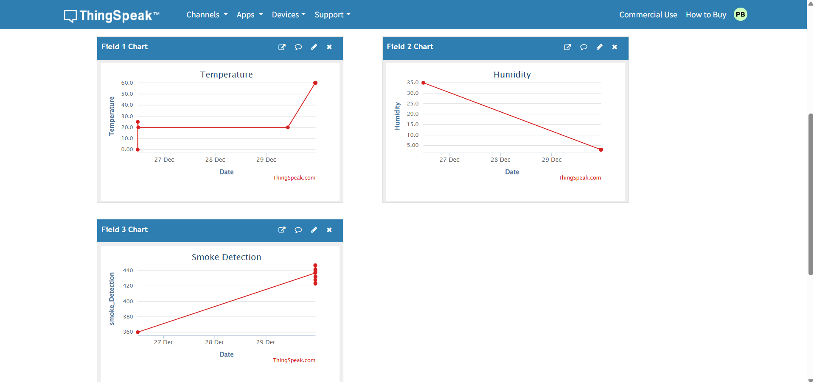

## 📌 Project Overview
This project is an IoT-based environmental monitoring system designed to track
multiple environmental parameters using sensors and cloud visualization.
The system is modular and scalable, allowing easy integration of additional sensors
as per project requirements.

## Documentation
System architecture and protocol-related documentation is available
in the `docs/` directory.

ESP32 sensor data (DHT11, MQ2) is transmitted to ThingSpeak using HTTP protocol.
MQTT testing was attempted but limited due to network port restrictions.
MQTT integration is planned on BeagleBone Black with local broker and MySQL backend.

## Live Output Preview

### Objective
Establish real-time MQTT communication between ESP32 and BeagleBone.

### Workflow
ESP32 → MQTT Broker → BeagleBone

### Outcome
- Continuous data publishing from ESP32
- Successful MQTT subscription on BeagleBone
- Internet connectivity verified

## 🔧 Hardware Components
- ESP32 Development Board
- Environmental Sensors (DHT11, MQ2 – currently implemented)
- Gateway Device (BeagleBone Black – planned)

## 📊 Features
- Real-time monitoring of environmental parameters  
- Support for multiple sensor inputs  
- Modular system architecture  
- Cloud-based data visualization  
- Gateway-based data processing (planned)

## 🔮 Future Scope
- Integration of additional environmental sensors  
- MQTT-based publish–subscribe communication  
- Local data storage and analytics  
- Advanced dashboards and alert mechanisms  
